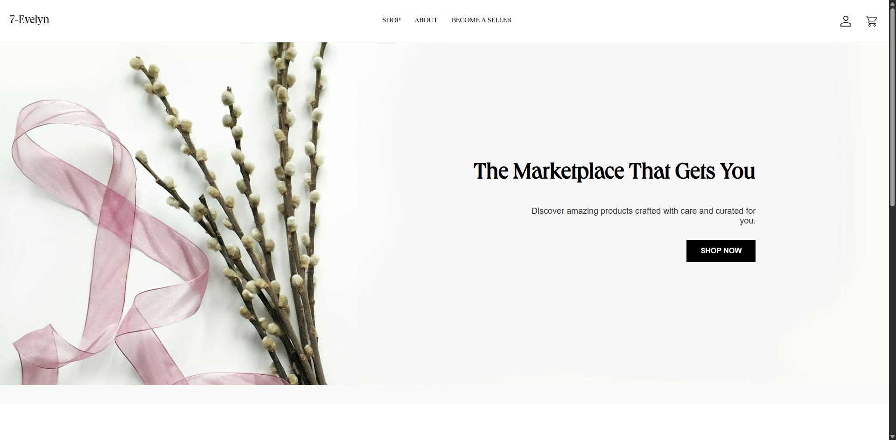
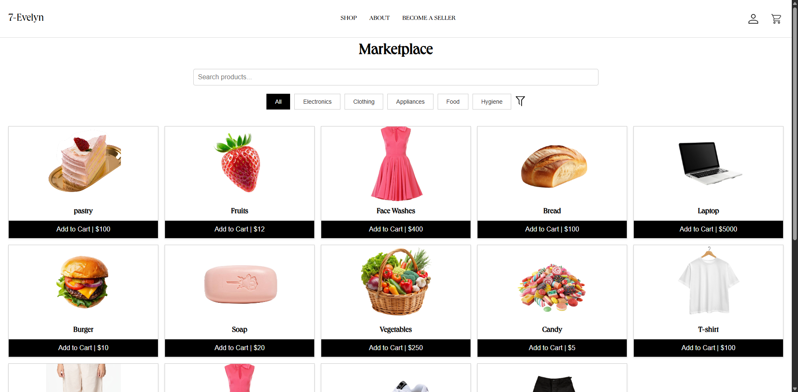
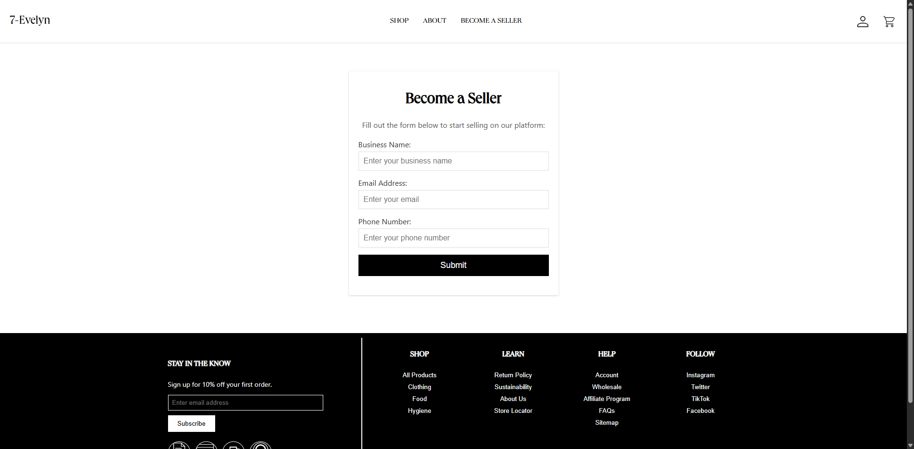
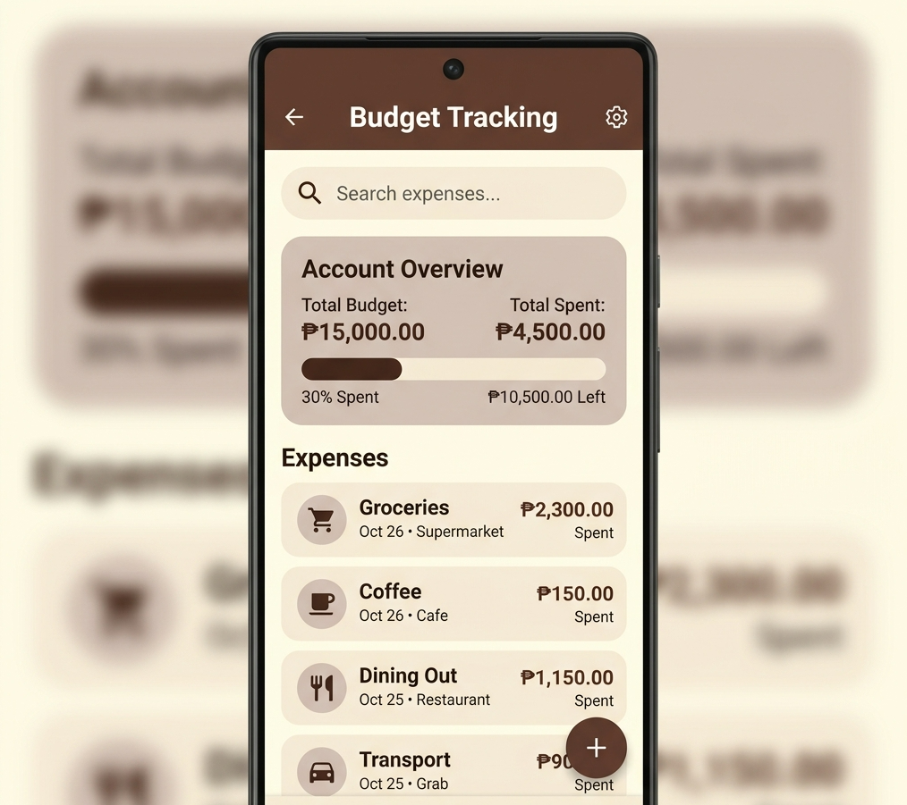
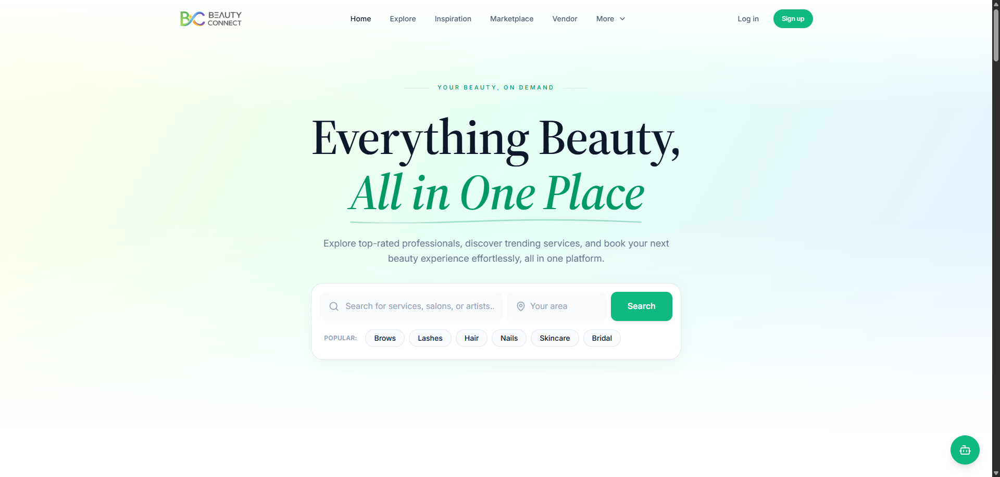
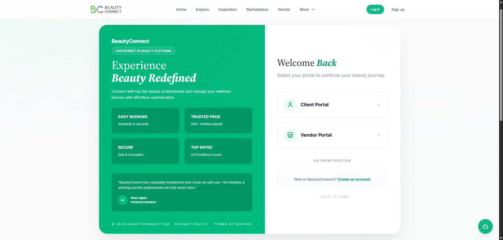

# Hi there, I'm Karl! 👋

> **Frontend & Full-Stack Developer** dedicated to building pixel-perfect, responsive interfaces and standardizing production-ready UI/UX components.

---

##  Languages and Tools

 

  

##  Featured Projects

###  FRAMES (Facial Recognition & Attendance Monitoring with Embedded System)
*Thesis / Capstone Project* |  [Vercel Link](https://frames-smartattendance.vercel.app/)

*   **The Run-Down:** Automated attendance system combining software logic with embedded hardware.
*   **Stack:** React.js, Python, Express.js (hosted in Aiven), Raspberry Pi, OpenCV, MediaPipe, Web Interface.
*   **Engineering Highlight:** Optimizing responsive UI components and ensuring stable real-time data synchronization.

###  Simple Social Media Website
*Full-Stack Web Application* |  *Environment: Localhost*

[ 🖼️ Put Social App Screenshot Here ]

*   **The Run-Down:** A social networking platform enabling seamless user interaction and real-time feed updates.
*   **Features:** Posting, Reacting, Messaging, Friends, Comments, and Reposting.
*   **Stack:** React.js, Supabase.

###  Full-Stack E-Commerce Platform
*Web Application* |  *Environment: Localhost*

  

  

  

*   **The Run-Down:** Web application featuring full product catalogs, a dynamic state-managed shopping cart, and user checkout.
*   **Stack:** React.js, MySQL.

###  Budget Tracker
*Financial Tool* |  *Environment: Localhost*

  

*   **The Run-Down:** Dynamic budgeting application built to track expenses and manage personal transactions.
*   **Stack:** React.js, Bootstrap, Node.js, MySQL.

---

##  Industry Experience

**NexVision Innovations Inc.** *[Facebook](https://www.facebook.com/share/1HGdb33a4J/)*

*Front End Developer Intern (Feb 2026 – May 2026)*

  

  

*   Rendered production-ready frontend features using **React, TypeScript, and Tailwind CSS**.
*   Standardized UI/UX consistency across client, admin, and vendor dashboard portals.
*   Optimized layout mobile responsiveness and web data performance constraints.

---

##  Education & Affiliations

*   **BS in Information Technology** | Technological University of the Philippines - Manila (2022 – Present)
    *   *DOST-SEI Scholar (JLSS Program)*
*   **Active Member:** GDGOC TUPM | TUPM DOST Scholars Club

---

✨ *Building scalable web applications, one sprint at a time.*
